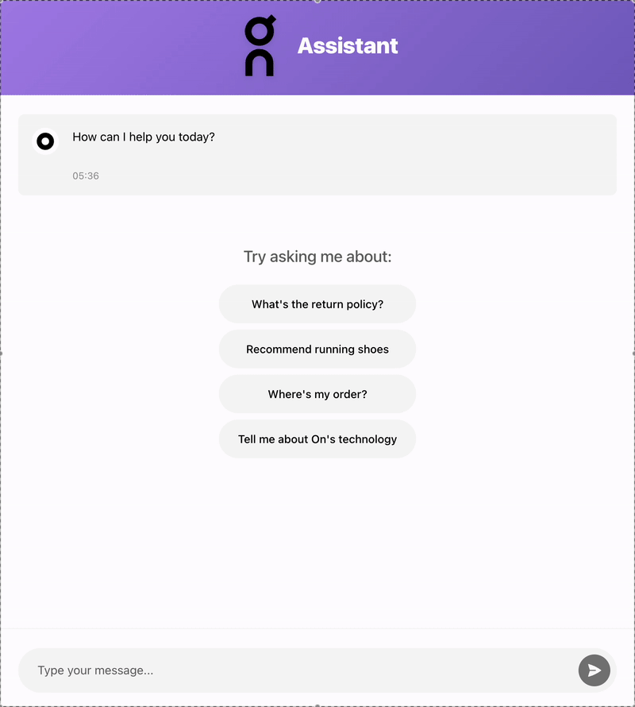

# Conversational Commerce Chat UI

A production-ready chat interface for an AI Copilot that guides customers through pre-purchase and post-purchase inquiries. Built with Vue 3 and TypeScript.

## Features

- Real-time chat interface with streaming responses
- Minimalist design
- Fully typed with TypeScript
- State management with Pinia
- CSS Modules for component-scoped styling
- Comprehensive error handling
- Mobile responsive design
- Production-ready architecture

## Demo



## Prerequisites

- Node.js (v16 or higher)
- npm (v7 or higher)

## Setup Instructions

1. **Clone the repository**
   ```bash
   git https://github.com/GeorgeChatzigiannis/conversational-commerce.git
   cd conversational-commerce
   ```

2. **Install dependencies**
   ```bash
   npm install
   ```

3. **Configure environment variables**
   ```bash
   cp .env.example .env
   ```
   Edit `.env` and add your API credentials:
   ```
   VITE_CONVAI_API_KEY=your_actual_api_key_here
   VITE_CONVAI_API_URL=https://example-url.com/api/agents/copilotAgent/stream
   ```

4. **Start development server**
   ```bash
   npm run dev
   ```
   The application will be available at `http://localhost:3000`

## Build for Production

1. **Build the application**
   ```bash
   npm run build
   ```
   This will create an optimized production build in the `dist` directory.

2. **Preview production build**
   ```bash
   npm run preview
   ```

## Available Scripts

- `npm run dev` - Start development server
- `npm run build` - Build for production
- `npm run preview` - Preview production build
- `npm run test` - Run tests in watch mode
- `npm run test:unit` - Run tests once
- `npm run test:coverage` - Run tests with coverage report
- `npm run lint` - Lint and fix code
- `npm run format` - Format code with Prettier
- `npm run typecheck` - Type check TypeScript files

## Project Structure

```
src/
├── components/             # Vue components
│   ├── __tests__/         # Component tests
│   ├── ChatContainer.vue  # Main chat container
│   ├── Message.vue        # Individual message display
│   ├── MessageInput.vue   # Chat input field
│   ├── MessageList.vue    # Message list with auto-scroll
│   ├── OnLogo.vue         # Brand logo component
│   └── OnLogoIcon.vue     # Brand icon component
├── composables/            # Vue composables
│   ├── __tests__/
│   └── useChatResponse.ts # Stream response handler
├── services/              # API services
│   ├── __tests__/
│   └── chat.ts           # Chat API integration
├── stores/                # Pinia stores
│   ├── __tests__/
│   └── chat.ts           # Chat state management
├── types/                 # TypeScript types
│   ├── chat.ts           # Chat related types
│   └── chatResponse.ts   # Stream response types
├── utils/                 # Utility functions
│   ├── __tests__/
│   ├── markdownProcessor.ts  # Markdown parsing
│   ├── streamParser.ts       # Stream parsing utilities
│   └── streamProcessor.ts    # Stream data processing
├── styles/                # Global styles
│   └── global.css
├── App.vue               # Root component
└── main.ts              # Application entry point
```

## Architecture Overview

### State Management
The application uses Pinia for state management, with a centralized chat store that handles:
- Message history
- Loading states
- Error handling
- Thread and resource ID management

### API Integration
The chat service handles communication with the Convai API:
- Supports streaming responses
- Automatic error handling and retry logic
- Configurable timeouts

### Component Design
- **ChatContainer**: Main container component
- **MessageList**: Displays chat messages with auto-scroll
- **Message**: Individual message component with role-based styling
- **MessageInput**: Text input with send functionality

### Styling
- CSS Modules for component isolation
- CSS custom properties for theming
- Responsive mobile-first design approach 

## Testing

The project includes comprehensive test coverage using Vitest and Vue Test Utils.

Run tests:
```bash
npm run test:unit
```

## Deployment

The built application can be deployed to any static hosting service.
Ensure environment variables are properly configured in your deployment platform.

## Example Queries

Test the chat interface with these sample queries:
- "What's the return policy?"
- "Recommend running shoes"
- "Where's my order?"
- "Tell me about On's technology"
